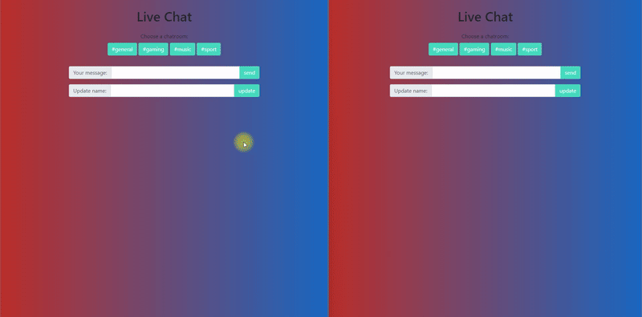

# Web Chat Application

## Description

This project is a web-based chat application designed to facilitate real-time communication between users. It utilizes HTML, CSS, and JavaScript to provide an interactive and user-friendly interface.

## Preview

## Technologies Used

- HTML: Structures the web pages and content.
  - Official Documentation: [MDN HTML](https://developer.mozilla.org/en-US/docs/Web/HTML)
- CSS: Styles the visual appearance of the web pages.
  - Official Documentation: [MDN CSS](https://developer.mozilla.org/en-US/docs/Web/CSS)
- JavaScript: Adds interactivity and real-time features to the web pages.
  - Official Documentation: [MDN JavaScript](https://developer.mozilla.org/en-US/docs/Web/JavaScript)
- Bootsrap
  - Official Documentation: [Bootstrap](https://getbootstrap.com/)
- Firebase
  - Official Documentation: [Firebase](https://firebase.google.com/)

## Features

- Real-time messaging between users.
- Group chat functionality.
- Responsive design for desktop and mobile devices.

## Setup

To set up this project locally, follow these steps:

1. Clone the repository to your local machine.
2. Open `index.html` in your web browser to start the application.
3. No additional setup is required to begin using the application.

## Usage

1. Create a user profile with a unique username.
2. Start a new chat by selecting a user or joining a group chat.
3. Send messages in real-time.
